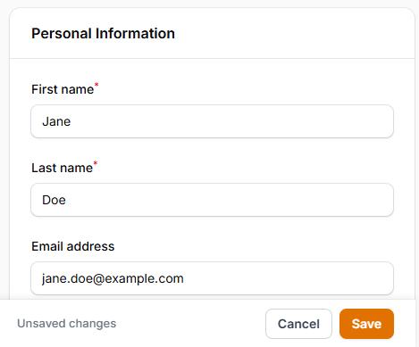
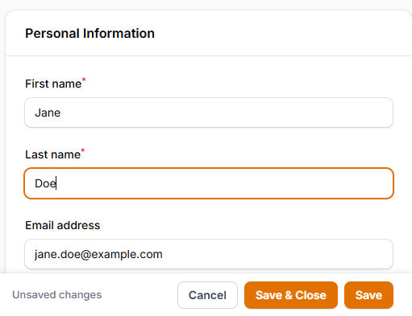

# Filament Sticky Save Bar

[](https://packagist.org/packages/cocosmos/filament-sticky-save-bar)
[](https://packagist.org/packages/cocosmos/filament-sticky-save-bar)

A Filament v5 plugin that displays a floating action bar at the bottom (or top) of the viewport when a form has unsaved changes — so users on long edit pages never have to scroll back up to save.

---

## Features

- Automatically appears when the form is dirty (has unsaved changes)
- Disappears after a successful save
- Detects changes from all input types, including multiselect fields
- Reverts to hidden state if the user undoes all changes
- Hides when a modal is open
- Respects the Filament sidebar — never overlaps it
- Supports dark mode
- Translatable (8 languages included)
- Per-page opt-out via a trait

---

## Requirements

- PHP 8.2+
- Filament 5.x

---

## Installation

Install via Composer:

```bash
composer require cocosmos/filament-sticky-save-bar
```

Register the plugin in your panel provider:

```php
use Cocosmos\FilamentStickySaveBar\StickySaveBarPlugin;

public function panel(Panel $panel): Panel
{
    return $panel
        // ...
        ->plugin(StickySaveBarPlugin::make());
}
```

---

## Basic Usage

Once registered, the bar appears automatically on any page that contains a `wire:submit` form with unsaved changes.



---

## Configuration

All options are set fluently on the plugin instance.

### Label

Override the default "Unsaved changes" label:

```php
StickySaveBarPlugin::make()
    ->label('You have unsaved changes')
```

### Position

Pin the bar to the top of the viewport instead of the bottom:

```php
use Cocosmos\FilamentStickySaveBar\Enums\Position;

StickySaveBarPlugin::make()
    ->position(Position::Top)
```

| Value | Description |
|---|---|
| `Position::Bottom` | *(default)* Pinned to the bottom of the viewport |
| `Position::Top` | Pinned to the top of the viewport |

### Show On

Control when the bar becomes visible:

```php
use Cocosmos\FilamentStickySaveBar\Enums\ShowOn;

StickySaveBarPlugin::make()
    ->showOn(ShowOn::Always)
```

| Value | Description |
|---|---|
| `ShowOn::Dirty` | *(default)* Only when the form is dirty **and** the native Save button has scrolled out of view |
| `ShowOn::Always` | Whenever the native Save button is out of view, regardless of dirty state |

### Extra Buttons

#### Cancel

A **Cancel** button that navigates back. Enabled by default.

```php
StickySaveBarPlugin::make()
    ->withCancel()        // enable (default)
    ->withCancel(false)   // disable
```

#### Save & Close

A **Save & Close** button that saves the form and then navigates back.

```php
StickySaveBarPlugin::make()
    ->withSaveAndClose()        // enable
    ->withSaveAndClose(false)   // disable (default)
```

#### Discard

A **Discard changes** button that reloads the page, reverting all unsaved edits.

```php
StickySaveBarPlugin::make()
    ->withDiscard()        // enable
    ->withDiscard(false)   // disable (default)
```



### Enabled

Disable the plugin globally, or conditionally via a closure:

```php
StickySaveBarPlugin::make()
    ->enabled(false)

// Or with a closure:
StickySaveBarPlugin::make()
    ->enabled(fn () => auth()->user()->isAdmin())
```

---

## Per-Page Opt-Out

To disable the bar on a specific page, add the `HasStickySaveBarDisabled` trait to the page class:

```php
use Cocosmos\FilamentStickySaveBar\Concerns\HasStickySaveBarDisabled;

class EditInvoice extends EditRecord
{
    use HasStickySaveBarDisabled;

    // ...
}
```

---

## Translations

The plugin ships with translations for 8 languages: `ar`, `de`, `en`, `es`, `fr`, `id`, `it`, `pt`.

To publish and customise them:

```bash
php artisan vendor:publish --tag=sticky-save-bar-translations
```

The published files will appear in `lang/vendor/sticky-save-bar/{locale}/sticky-save-bar.php`.

### Translation keys

| Key | Default (en) |
|---|---|
| `unsaved_changes` | Unsaved changes |
| `save` | Save |
| `cancel` | Cancel |
| `save_and_close` | Save & Close |
| `discard` | Discard changes |

---

## Changelog

See [CHANGELOG.md](CHANGELOG.md).

---

## License

MIT — see [LICENSE](LICENSE).
